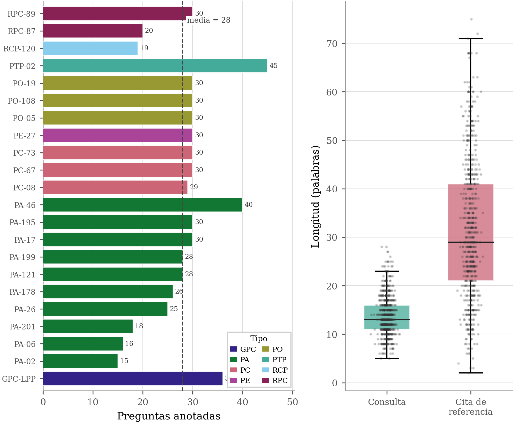
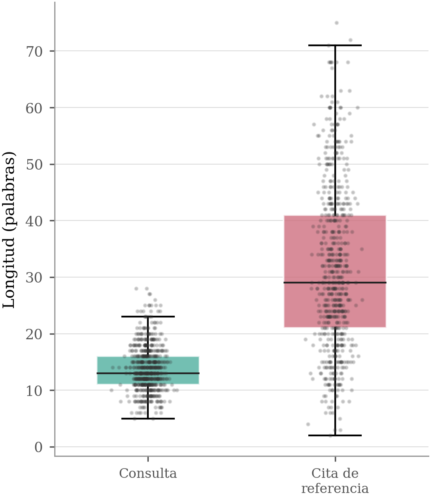
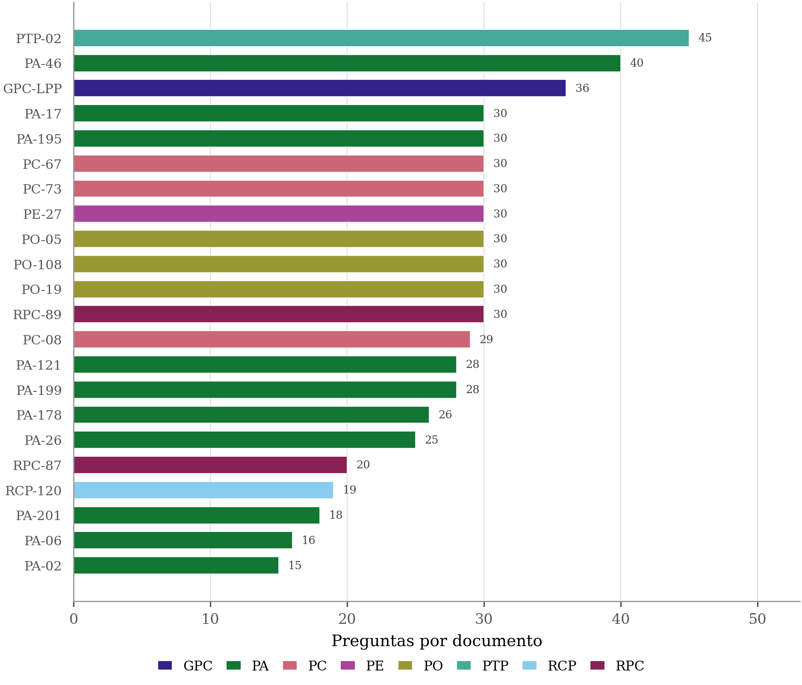
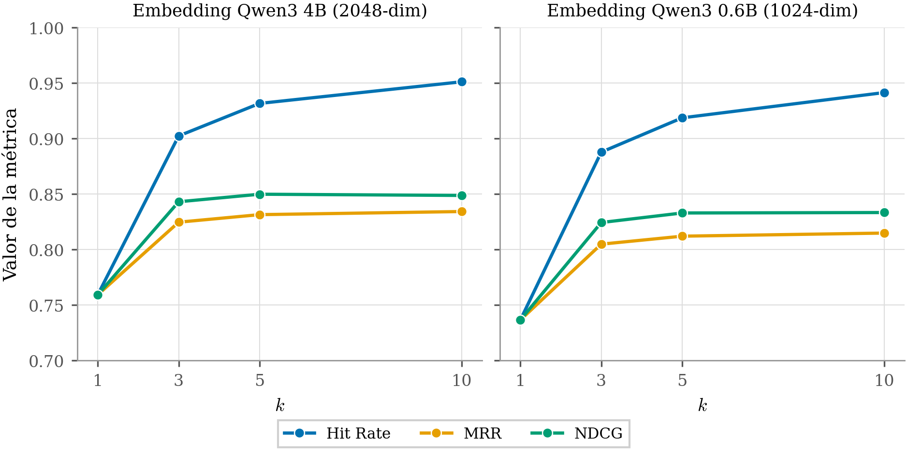
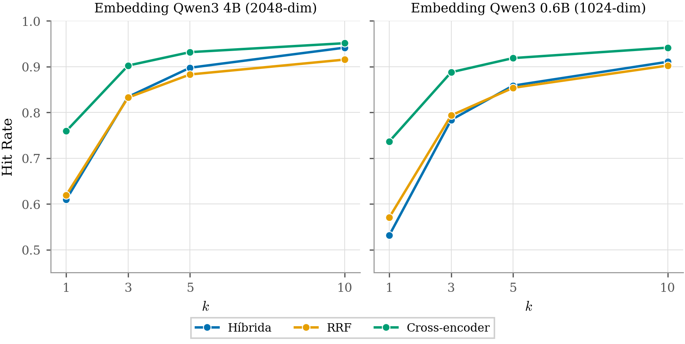
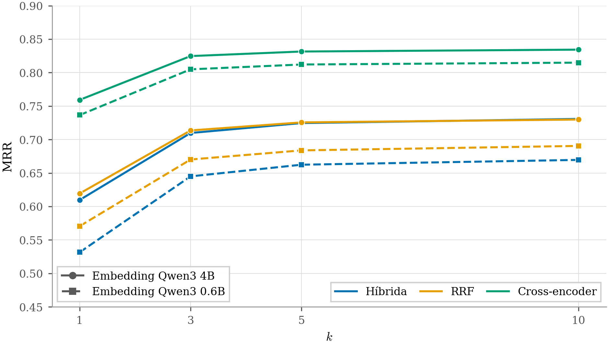
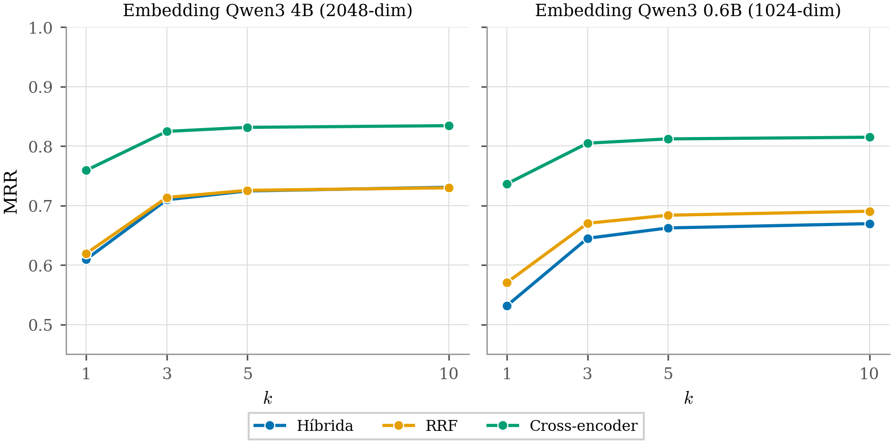
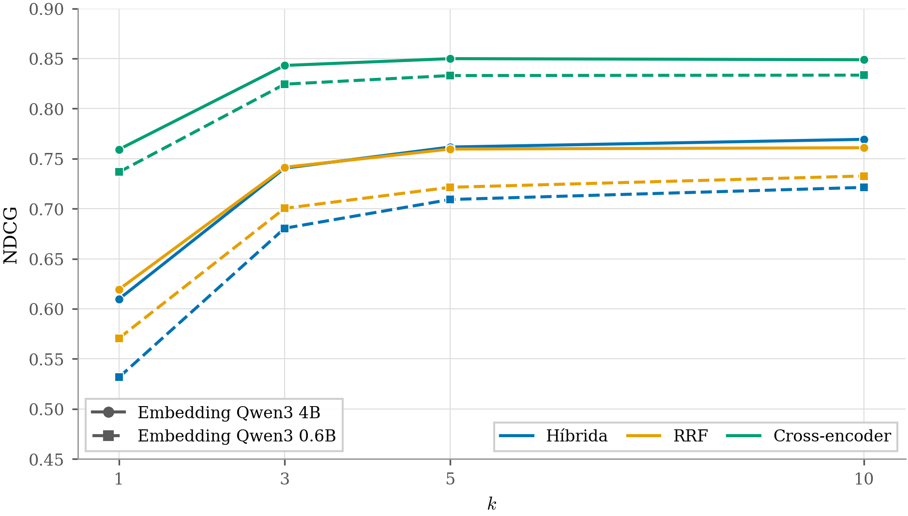
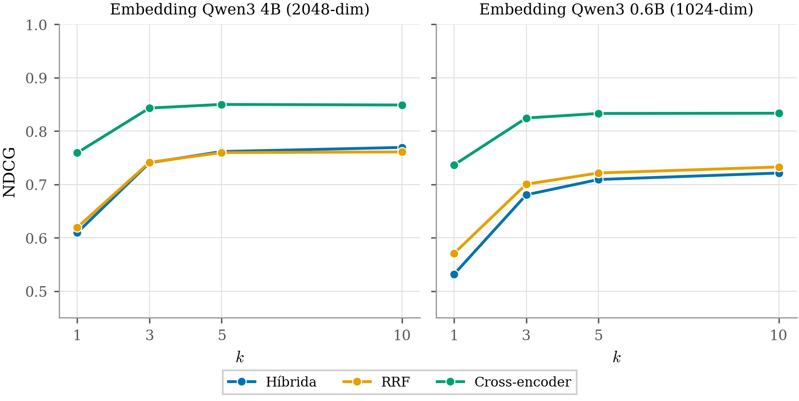

<!-- Generado por _build/generar_textos.py — no editar a mano -->

# Experimento 1 · Recuperación por documento

**Pregunta:** cuando la consulta se dirige a un protocolo concreto, ¿qué estrategia de
ordenación recupera mejor la sección que contiene la respuesta, y cuánto se pierde al
sustituir el modelo de embedding de 4B de parámetros por uno de 0.6B?

## Diseño

615 preguntas repartidas entre los 22 protocolos del corpus. Cada una
lleva la frase literal del documento que la responde y la sección que la contiene, de
modo que la relevancia puede comprobarse y no depende de un juicio subjetivo.

Sobre los mismos candidatos recuperados se comparan tres estrategias de ordenación y dos
modelos de embedding, con top-k 10. Un fragmento se considera relevante si su sección
contiene la respuesta, con umbral de recall léxico 0,7.

## Resultado

| Modelo de embedding | Estrategia | hit@1 | hit@5 | hit@10 | mrr@10 |
|---|---|---|---|---|---|
| Qwen3-Embedding 0.6B | Cross-encoder | 0,737 | 0,919 | 0,942 | 0,815 |
| Qwen3-Embedding 0.6B | Híbrida | 0,532 | 0,859 | 0,911 | 0,670 |
| Qwen3-Embedding 0.6B | RRF puro | 0,571 | 0,854 | 0,902 | 0,691 |
| Qwen3-Embedding 4B | Cross-encoder | 0,759 | 0,932 | 0,951 | 0,834 |
| Qwen3-Embedding 4B | Híbrida | 0,610 | 0,898 | 0,942 | 0,731 |
| Qwen3-Embedding 4B | RRF puro | 0,620 | 0,883 | 0,915 | 0,730 |


Mejor combinación en acierto entre los cinco primeros: **Qwen3-Embedding 4B**
con **Cross-encoder** (0,932).

El cross-encoder gana en todas las configuraciones. La penalización por usar el modelo de
embedding pequeño existe, pero el reordenador la absorbe en buena medida: la distancia
entre 4B y 0.6B es mucho menor con cross-encoder que sin reordenar.

## Contenido

| Ruta | Qué es |
|---|---|
| `preguntas/` | 22 conjuntos, uno por protocolo, con la cita de referencia de cada pregunta |
| `resultados/embedding-4b/` | 66 ejecuciones (22 protocolos × 3 estrategias) |
| `resultados/embedding-06b/` | 66 ejecuciones con el modelo pequeño |
| `resultados/*/section_metrics_summary.json` | métricas agregadas: de aquí salen las tablas |
| `resultados/*/section_overrides.json` | correcciones de etiquetado tras revisión humana |

Cada `results_*.json` guarda, por pregunta: la consulta, la sección esperada, la cita de
referencia, la reformulación del router, los diez documentos recuperados en orden con su
etiqueta de relevancia, los tiempos por fase, la respuesta generada y el recuento de tokens.

## Reproducir

Las cifras de la tabla se leen directamente:

```bash
python3 -c "
import json
m = json.load(open('experimentos/1-recuperacion-por-documento/resultados/embedding-4b/section_metrics_summary.json'))
print({k: v for k, v in m['strategies']['cross_encoder'].items() if k.startswith('sec@0.7')})"
```

Recalcularlas desde los resultados crudos requiere el corpus en base de datos, porque la
etiqueta de relevancia se decide comparando la cita contra el texto completo de la sección.
Véase la nota de reproducibilidad en el README raíz.

## Advertencia sobre el etiquetado

El etiquetado automático marca un fragmento como relevante si la cita de referencia tiene
recall léxico ≥ 0,7 en el texto de su sección. Ese filtro falla cuando la pregunta está
redactada con vocabulario distinto al del protocolo, así que se revisaron a mano todos los
pares y se anotó la sección correcta donde hacía falta.

Hay **35 correcciones declaradas** en `section_overrides.json`, y se concentran en sólo
2 de los 22 protocolos (PE27 y PA195) — los dos con la
redacción más alejada del lenguaje de las preguntas. No todas llegan a cambiar una
etiqueta: una corrección es inerte si el filtro ya había acertado. El recuento de las que
sí tuvieron efecto, y su impacto sobre las métricas publicadas, está auditado en
[docs/trazabilidad.md](../../docs/trazabilidad.md), §4. Afectan a algo más del 5 % de los
pares evaluados y su efecto es homogéneo entre las tres estrategias, por lo que no altera
la ordenación relativa entre ellas.

132 ejecuciones publicadas en total para este experimento.

## Figuras

Las mismas que aparecen en la memoria.

### Distribución de las preguntas



### Longitud de preguntas y respuestas



### Preguntas por protocolo



### Familias de métricas empleadas



### Evolución del acierto con k



### MRR de los dos modelos de embedding



### Evolución del MRR con k



### MRR y nDCG comparados


### nDCG de los dos modelos de embedding



### Evolución del nDCG con k



