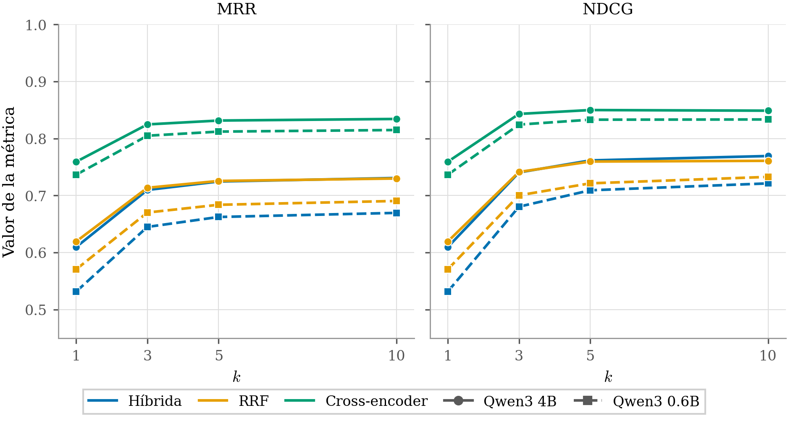

<!-- Generado por _build/generar_textos.py — no editar a mano -->

# Experimento 1 · Recuperación

**Respalda la Tabla 5.1 de la memoria** («Recuperación a nivel de *chunk*. 615 preguntas
por configuración, K = 10, generador gemma-4 26B-A4B»).

> Las cifras de esta página son las **impresas en la memoria**. Para comprobar
> que salen de los datos de este repositorio:
>
> ```bash
> python3 herramientas/verificar_memoria.py
> ```

## Qué se midió

Con la consulta dirigida a un protocolo concreto, qué estrategia de ordenación recupera
mejor la sección que contiene la respuesta, y cuánto se pierde al sustituir el modelo de
*embedding* de 4B de parámetros por uno de 0.6B.

## Diseño

615 preguntas repartidas entre los 22 protocolos del corpus. Cada una
lleva la frase literal del documento que la responde y la sección que la contiene, de modo
que la relevancia se comprueba y no depende de un juicio subjetivo.

Sobre los mismos candidatos recuperados se comparan tres estrategias de ordenación y dos
modelos de *embedding*, con K = 10 y el generador fijo (gemma-4 26B-A4B) para aislar el
efecto del recuperador. Un fragmento cuenta como relevante si su sección contiene la
respuesta, con umbral de *recall* léxico 0,7.

## Tabla 5.1

| Embedding | Estrategia | Hit@1 | Hit@3 | Hit@5 | Hit@10 | MRR@10 | NDCG@10 |
|---|---|---|---|---|---|---|---|
| 4B | Cross-encoder | 0,759 | 0,902 | 0,932 | 0,951 | 0,834 | 0,849 |
| 4B | Híbrida | 0,610 | 0,834 | 0,898 | 0,942 | 0,731 | 0,769 |
| 4B | RRF puro | 0,620 | 0,833 | 0,883 | 0,915 | 0,730 | 0,761 |
| 0.6B | Cross-encoder | 0,737 | 0,888 | 0,919 | 0,942 | 0,815 | 0,833 |
| 0.6B | Híbrida | 0,532 | 0,784 | 0,859 | 0,911 | 0,670 | 0,721 |
| 0.6B | RRF puro | 0,571 | 0,794 | 0,854 | 0,902 | 0,691 | 0,733 |

El *cross-encoder* gana en todas las configuraciones. La penalización por usar el modelo
pequeño existe, pero el reordenador la absorbe en buena parte: 2,2 puntos de Hit@1 con
*cross-encoder* frente a 7,8 sin él.

## Contenido

| Ruta | Qué es |
|---|---|
| `preguntas/` | 22 conjuntos, uno por protocolo, con la cita de referencia de cada pregunta |
| `resultados/embedding-4b/` | 66 ejecuciones (22 protocolos × 3 estrategias) |
| `resultados/embedding-06b/` | 66 ejecuciones con el modelo pequeño |
| `resultados/*/section_metrics_summary.json` | métricas agregadas: **de aquí sale la tabla** |
| `resultados/*/section_overrides.json` | correcciones de etiquetado tras revisión humana |

Cada `results_*.json` guarda, por pregunta: la consulta, la sección esperada, la cita de
referencia, la reformulación del router, los diez fragmentos recuperados en orden con su
etiqueta de relevancia, los tiempos por fase, la respuesta generada y el recuento de tokens.

## Sobre el etiquetado

El filtro automático marca un fragmento como relevante si la cita de referencia tiene
*recall* léxico ≥ 0,7 en el texto de su sección. Falla cuando la pregunta usa vocabulario
distinto al del protocolo, así que se revisaron a mano todos los pares y se anotó la
sección correcta donde hacía falta: **35 correcciones**, concentradas en
2 de los 22 protocolos (PE27 y PA195).

El recuento de las que llegaron a cambiar una etiqueta y su efecto sobre las métricas está
en [docs/trazabilidad.md](../../docs/trazabilidad.md), §4. Afectan a algo más del 5 % de
los pares y su efecto es homogéneo entre estrategias, por lo que no altera la ordenación.

## Un matiz sobre el enunciado de la tabla

El pie de la Tabla 5.1 dice «a nivel de *chunk*», pero las métricas publicadas son las
claves `sec@0.7_*`, es decir, **relevancia a nivel de sección**: un fragmento cuenta como
relevante si la sección a la que pertenece contiene la respuesta. Es coherente con el
diseño del sistema, que reconstruye la sección completa a partir de cualquiera de sus
fragmentos, pero el pie de figura debería decir «sección».

## Reproducir

```bash
python3 -c "
import json
m = json.load(open('experimentos/1-recuperacion/resultados/embedding-4b/section_metrics_summary.json'))
print({k: v for k, v in m['strategies']['cross_encoder'].items() if k.startswith('sec@0.7')})"
```

Recalcular las métricas desde los resultados crudos requiere el corpus en base de datos,
porque la etiqueta de relevancia se decide contra el texto completo de la sección. Véase la
nota de reproducibilidad en el README raíz.

## Figuras

Las mismas que aparecen en la memoria.

### Curvas de Hit Rate para cada estrategia (Figura 5.2)


### Evolución de MRR y NDCG (Figura 5.3)



### Desglose de tiempos por fase (Figura 5.1)


