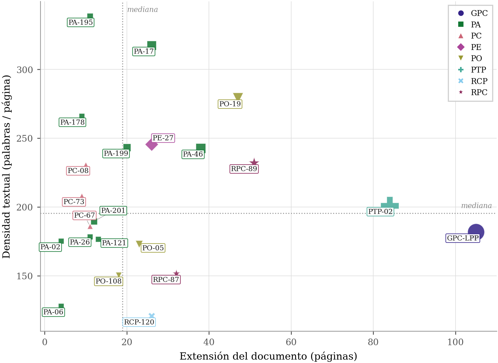
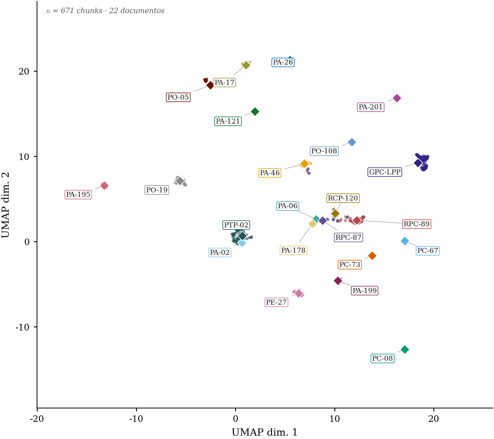
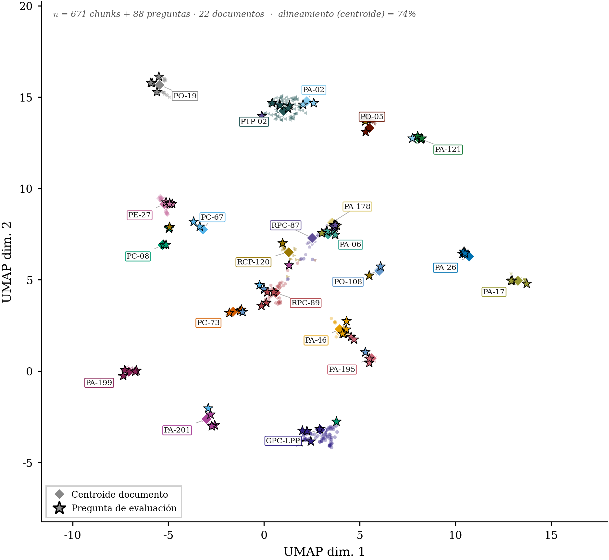
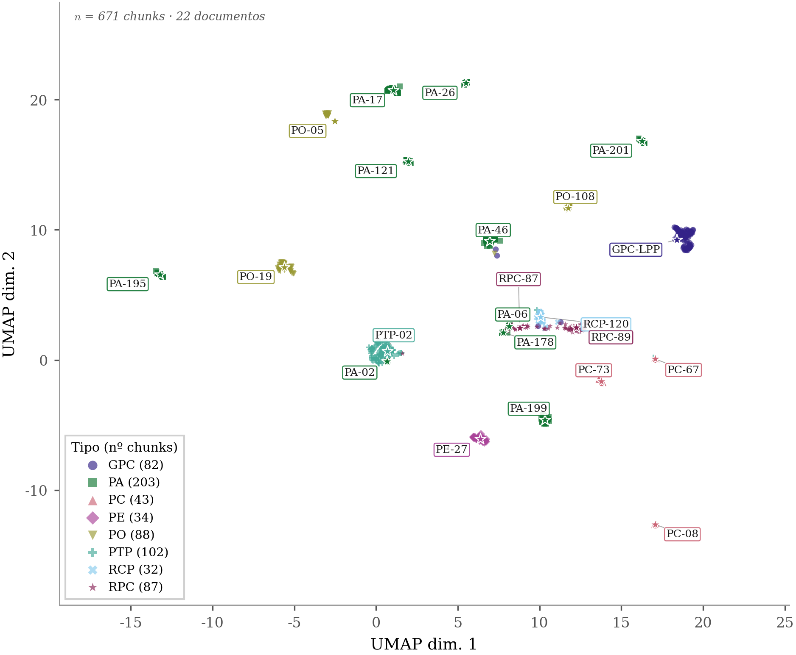

<!-- Generado por _build/generar_textos.py — no editar a mano -->

# Experimento 2 · Recuperación multi-documento

**Pregunta:** el experimento 1 es benévolo, porque el sistema sabe implícitamente de qué
documento se habla. ¿Qué ocurre cuando las preguntas saltan de un protocolo a otro dentro
de una misma conversación, con contexto previo no relacionado en la memoria?

## Diseño

110 preguntas muestreadas de los 22 conjuntos por documento (semilla 42, cinco por
protocolo), mezcladas en orden aleatorio y ejecutadas compartiendo bloque de memoria: cada
pregunta llega con historial de un tema distinto. No son preguntas nuevas, son las mismas
del experimento 1 en condiciones más duras.

## Resultado

| Modelo de embedding | Estrategia | hit@1 | hit@5 | hit@10 | mrr@10 |
|---|---|---|---|---|---|
| Qwen3-Embedding 0.6B | Cross-encoder | 0,627 | 0,827 | 0,836 | 0,709 |
| Qwen3-Embedding 0.6B | Híbrida | 0,500 | 0,746 | 0,791 | 0,611 |
| Qwen3-Embedding 0.6B | RRF puro | 0,500 | 0,746 | 0,800 | 0,611 |
| Qwen3-Embedding 4B | Cross-encoder | 0,636 | 0,855 | 0,891 | 0,734 |
| Qwen3-Embedding 4B | Híbrida | 0,536 | 0,846 | 0,864 | 0,658 |
| Qwen3-Embedding 4B | RRF puro | 0,554 | 0,827 | 0,836 | 0,668 |


El acierto cae respecto al escenario por documento. Esa caída es el coste real de enrutar
entre todo el corpus con el contexto contaminado por la conversación previa, y es la cifra
honesta para valorar el sistema en uso: nadie consulta un único protocolo por sesión.

La ordenación entre estrategias se mantiene, lo que sugiere que la dificultad añadida
afecta a todas por igual y no favorece a ninguna.

## Contenido

| Ruta | Qué es |
|---|---|
| `preguntas.json` | las 110 preguntas, con documento de origen y cita de referencia |
| `resultados/embedding-4b/` | 3 ejecuciones, una por estrategia |
| `resultados/embedding-06b/` | 3 ejecuciones con el modelo pequeño |

## Reproducir

La construcción del conjunto es determinista:

```bash
python3 herramientas/generar_gt_global.py
```

## Figuras

Las mismas que aparecen en la memoria.

### Dispersión del corpus



### Proyección UMAP de los documentos



### Proyección UMAP de las preguntas



### Proyección UMAP por tipo de contenido



