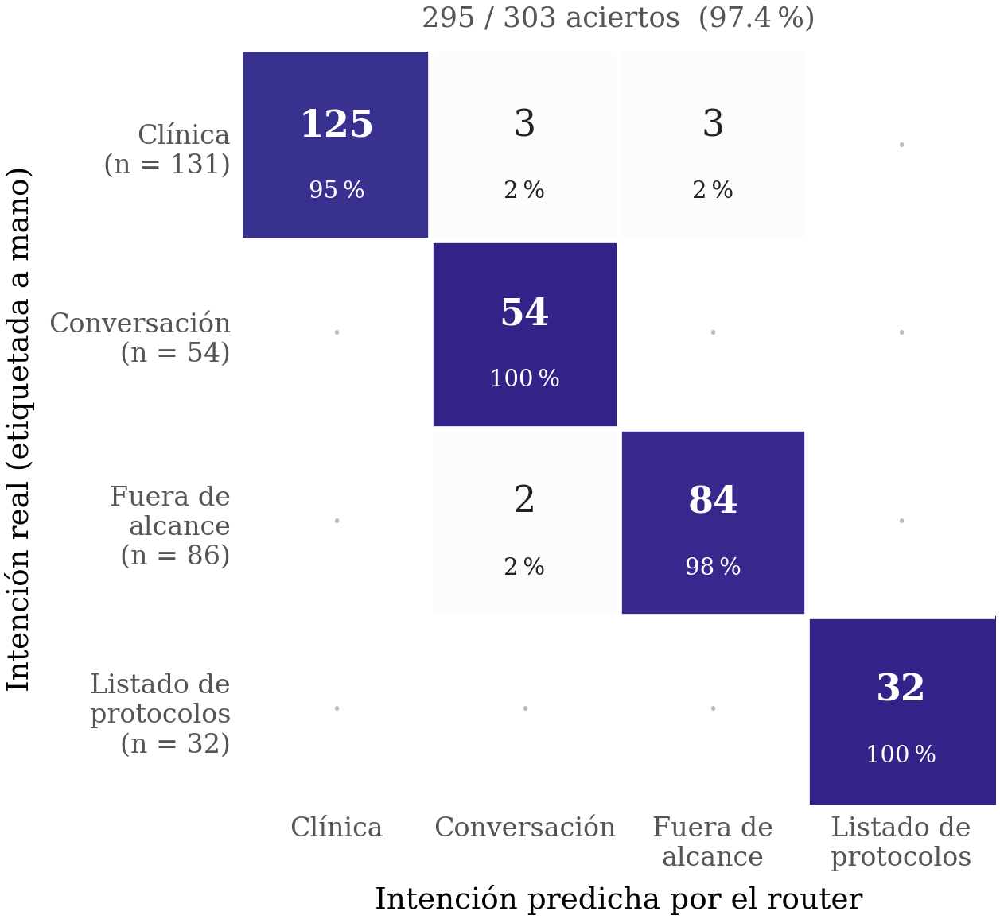

<!-- Generado por _build/generar_textos.py — no editar a mano -->

# Experimento 3 · Cortafuegos

**Pregunta:** un asistente clínico que improvisa cuando no sabe es peor que uno que no
existe. ¿Reconoce el sistema qué preguntas caen fuera de su corpus, y separa las consultas
clínicas de la charla y de los intentos de sacarlo de su ámbito?

Son dos mecanismos independientes y se miden por separado.

## Clasificación de intención

El router clasifica cada consulta en tres vías antes de recuperar nada. Sobre
303 casos etiquetados a mano:

**295 de 303 aciertos (97,4 %).**
5 casos se resolvieron por regla léxica antes de llegar al modelo.

| Esperado \ Predicho | clinica | conversacion | fuera_de_alcance | lista_protocolos |
|---|---|---|---|---|
| **clinica** | 125 | 3 | 3 | 0 |
| **conversacion** | 0 | 54 | 0 | 0 |
| **fuera_de_alcance** | 0 | 2 | 84 | 0 |
| **lista_protocolos** | 0 | 0 | 0 | 32 |

La versión anterior del conjunto, más pequeña, daba
93,6 % sobre 140 casos.

## Detección de preguntas fuera de corpus

Preguntas clínicas plausibles cuya respuesta no está en ninguno de los protocolos. Lo que
debe ocurrir es que el sistema lo diga, no que conteste con lo más parecido que encuentre.

| Configuración | n | Detectadas | Tasa |
|---|---|---|---|
| Umbral inicial | 40 | 0 | 0,0 % |
| Umbral 0,30 | 40 | 28 | 70,0 % |
| Validación | 20 | 18 | 90,0 % |

**La primera fila es un resultado negativo y se publica como tal.** Con el umbral de
relevancia original el sistema no marcaba ni una sola pregunta como fuera de alcance: el
cortafuegos, tal como estaba configurado, no cumplía su función. Bajar el umbral a 0,30 es
lo que lo hace utilizable, y la fila de validación mide el mecanismo ya corregido sobre un
conjunto distinto del que se usó para ajustarlo.

## Contenido

| Ruta | Qué es |
|---|---|
| `conjuntos/` | los conjuntos de casos etiquetados |
| `resultados/` | salida de cada ejecución, con la predicción y el tiempo por caso |

## Reproducir

`herramientas/eval_cortafuegos.py` es el script que produjo estos resultados, pero
**no puede reejecutarse desde este repositorio**: invoca el router, el recuperador y el
generador del sistema completo, que requiere el corpus indexado y los modelos servidos.
Se incluye como documentación exacta del método, no como herramienta ejecutable.

Lo que sí puede comprobarse sin nada instalado es el recuento sobre los resultados
publicados:

```bash
python3 -c "
import json
d = json.load(open('experimentos/3-cortafuegos/resultados/resultados_intent_v2.json'))
ok = sum(1 for x in d if x['acierto'])
print(f'{ok}/{len(d)} = {ok/len(d)*100:.1f} %')"
```

## Figuras

Las mismas que aparecen en la memoria.

### Matriz de confusión del clasificador de intención



