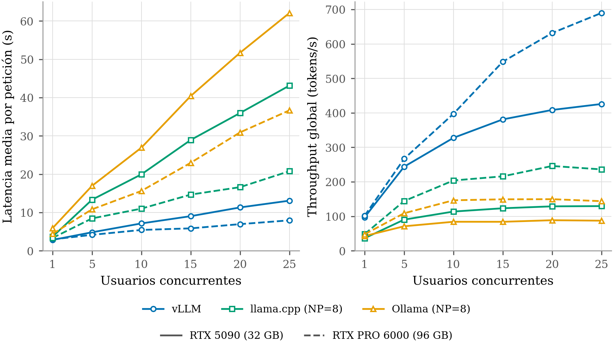
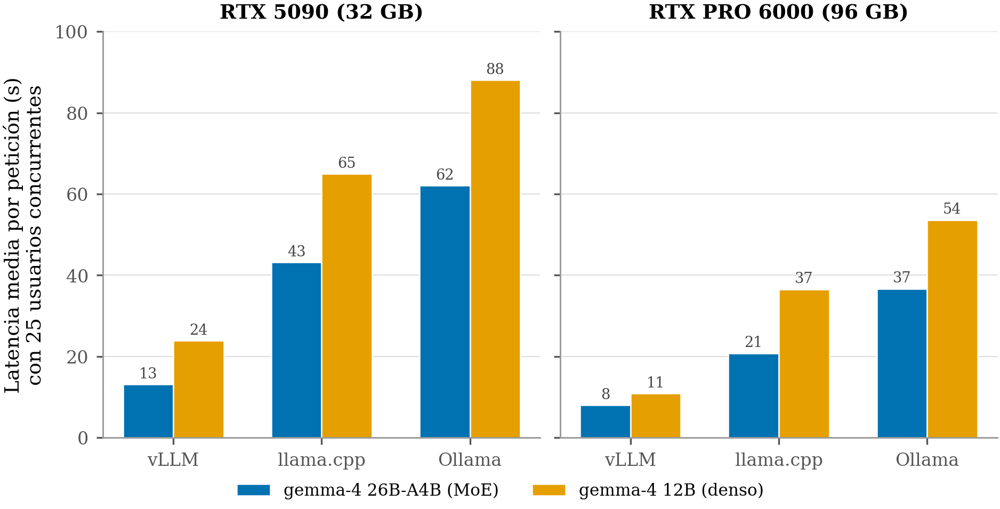
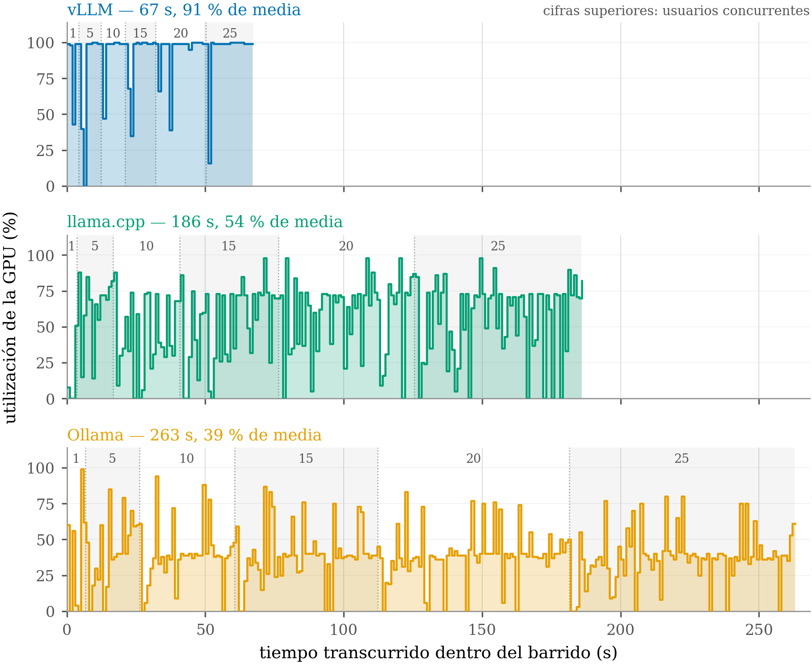

<!-- Generado por _build/generar_textos.py — no editar a mano -->

# Experimento 3 · Despliegue

**Respalda las Tablas 4.1 y 4.2 de la memoria** (TTFT, latencia y *stall* a 25 usuarios; y
comportamiento bajo saturación).

> Las cifras de esta página son las **impresas en la memoria**. Para comprobar
> que salen de los datos de este repositorio:
>
> ```bash
> python3 herramientas/verificar_memoria.py
> ```

## Qué se midió

Si el sistema aguanta varios profesionales consultando a la vez, qué motor de inferencia lo
sostiene mejor y dónde está el punto en que la latencia deja de ser aceptable.

## Diseño

Barridos de concurrencia con secuencias emparejadas: los mismos usuarios simulados, las
mismas preguntas y el mismo orden en todas las configuraciones, de modo que las diferencias
entre motores no puedan atribuirse a haber preguntado cosas distintas. Se crearon 10 bancos
de 110 preguntas y la repetición *k* usa la secuencia *k* en los tres motores.

- **609 barridos** sobre dos máquinas (RTX PRO 6000 de 96 GB y RTX 5090 de 32 GB)
- **3.716 mediciones** por nivel de concurrencia
- **58.152 peticiones** individuales con su TTFT y sus tiempos por fase
- **842 ventanas de telemetría** de GPU
- Umbral de *stall*: respuestas por encima de 90 s

## Tabla 4.1 — 25 usuarios concurrentes

| Máquina | Motor | TTFT p50 | TTFT p95 | Latencia p50 | Latencia p95 | *Stall* |
|---|---|---|---|---|---|---|
| RTX PRO 6000 | vllm | 4,5 | 7,1 | 8,6 | 11,8 | 0,0 % |
| RTX PRO 6000 | llamacpp | 12,8 | 25,2 | 20,1 | 33,1 | 0,0 % |
| RTX PRO 6000 | ollama | 23,4 | 40,6 | 34,7 | 50,3 | 1,6 % |
| RTX 5090 | vllm | 8,3 | 15,0 | 14,7 | 19,9 | 0,0 % |
| RTX 5090 | llamacpp | 32,1 | 50,4 | 44,0 | 59,3 | 0,0 % |
| RTX 5090 | ollama | 43,8 | 70,5 | 62,8 | 85,7 | 3,6 % |

Sirviendo gemma-4 26B-A4B; llama.cpp y Ollama con NP = 8.

> Las peticiones que se estancan nunca llegan a emitir primer token: aparecen en las
> columnas de latencia y de *stall*, no en las de TTFT. Son entre cuatro y cinco por celda,
> con tiempos totales de 185 a 198 s. Excluirlas cambia el resultado, así que las tablas se
> calculan incluyéndolas.

## Tabla 4.2 — Saturación con vLLM

| Máquina | Métrica | 10 | 25 | 50 | 75 | 100 | 150 | 200 |
|---|---|---|---|---|---|---|---|---|
| RTX PRO 6000 | Latencia p95 (s) | 6,5 | 11,3 | 15,6 | 18,6 | 24,0 | 36,7 | 42,9 |
| | *Stall* (%) | 0,0 | 0,0 | 0,0 | 0,0 | 0,0 | 0,0 | 0,0 |
| RTX 5090 | Latencia p95 (s) | 11,5 | 22,6 | 37,6 | 52,9 | 67,0 | 99,9 | 135,7 |
| | *Stall* (%) | 0,0 | 0,0 | 0,0 | 0,0 | 0,0 | 18,7 | 57,5 |

La máquina mayor no registra una sola respuesta por encima del umbral en todo el barrido.
La RTX 5090 sostiene el servicio hasta los cien usuarios y a partir de ahí se rompe con
rapidez.

## Contenido

| Ruta | Qué es |
|---|---|
| `peticiones.csv` | 58.152 filas, una por petición: **de aquí sale la Tabla 4.1 y la 4.2** |
| `barridos.csv` | 3.716 filas, una por campaña, motor, celda, repetición y nivel |
| `telemetria_resumen.csv` | 842 filas: utilización, potencia y memoria por ejecución y GPU |
| `telemetria_muestras.csv` | muestras individuales del modelo 26B, para las figuras de utilización |
| `configuraciones-de-motor.md` | parámetros exactos de arranque de cada motor |
| `informes/` | informes HTML autocontenidos con las tablas completas |

Las tablas CSV consolidan lo que en el árbol de trabajo eran miles de ficheros anidados.
Cada fila conserva la columna `origen` con la ruta del fichero del que salió, de modo que
cualquier medición puede rastrearse hasta su procedencia.

## Lo que no está

La telemetría en crudo de los modelos que no aparecen en la memoria y los volcados de
métricas de vLLM en formato Prometheus (unos 57 MB) quedan fuera. Se facilitan a quien los
solicite.

## Reproducir

```bash
python3 -c "
import csv, statistics as st
from collections import defaultdict
p = defaultdict(list)
for f in csv.DictReader(open('experimentos/3-despliegue/barridos.csv')):
    if f['motor'] and f['concurrencia'] == '25':
        p[(f['maquina'], f['motor'])].append(float(f['tiempo_muro_ms']))
for k, v in sorted(p.items()):
    print(f'{k[0]:9} {k[1]:9} mediana {st.median(v)/1000:6.1f} s  (n={len(v)})')"
```

## Figuras

Las mismas que aparecen en la memoria.

### Latencia y throughput frente a la concurrencia (Figura 4.4)



### Mezcla de expertos frente a modelo denso (Figura 4.5)



### Throughput sostenido bajo saturación (Figura 4.6)


### Eficiencia en tokens por julio (Figura 4.8)


### Utilización de la RTX 5090 por motor (Figura 4.7)


