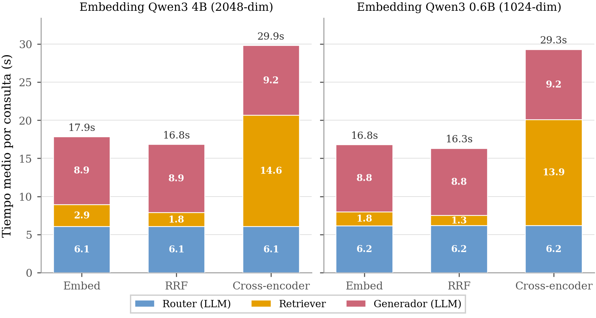

<!-- Generado por _build/generar_textos.py — no editar a mano -->

# Experimento 4 · Calidad de la respuesta generada

**Pregunta:** recuperar la sección correcta no basta. ¿Se apoya la respuesta en el texto
recuperado, o el modelo se aleja de él? ¿Cita sus fuentes, y son fuentes que existen?

## Diseño

Cinco medidas calculadas sobre el campo `generated_response` de las ejecuciones de los
experimentos 1 y 2. El cálculo es **íntegramente offline**: no reejecuta el sistema, sólo
analiza las respuestas ya registradas.

| Medida | Qué es |
|---|---|
| ROUGE-L | recall de la subsecuencia común más larga entre la cita de referencia y la respuesta |
| Recall de la cita | palabras de contenido de la cita que reaparecen en la respuesta |
| Retención de keywords | palabras clave emitidas por el router que reaparecen en la respuesta |
| Respuestas citadas | porcentaje de respuestas con al menos una marca `[n]` |
| Marcas en rango | porcentaje de marcas `[n]` con n dentro del número de fuentes entregadas |

## Qué NO miden

**Ninguna de estas medidas juzga la corrección clínica.** Miden solapamiento léxico con el
texto de referencia: una respuesta correcta redactada con otro vocabulario puntúa bajo, y
una respuesta equivocada que reutilice las palabras de la cita puntúa alto. Sólo tienen
sentido comparando configuraciones entre sí, nunca como valor absoluto de calidad.

«Marcas en rango» verifica que el generador no inventa números de fuente fuera del rango
que se le entregó. **No** verifica que la fuente citada sustente la afirmación concreta:
es una cota superior de la trazabilidad real, no una medida de ella.

De las 1.845 evaluaciones del conjunto de 615, catorce no tienen respuesta registrada por
un fallo de generación en la ejecución original, y dos de las 330 del multi-documento.
Se excluyen, de ahí que n sea 609-612 en vez de 615.

## Resultado

```
========================================================================================================
4B (615 preg.)   (eval/2026-05-19_topk10)
========================================================================================================
Estrategia        n  ROUGE-L  RecCita   RetKW  %c/cita  citas  %válidas  palabras  tok/s*  t_gen t_total

========================================================================================================
0.6B (615 preg.)   (eval/2026-05-31_06b_topk10)
========================================================================================================
Estrategia        n  ROUGE-L  RecCita   RetKW  %c/cita  citas  %válidas  palabras  tok/s*  t_gen t_total

========================================================================================================
4B (110 multi)   (eval/global_topk10)
========================================================================================================
Estrategia        n  ROUGE-L  RecCita   RetKW  %c/cita  citas  %válidas  palabras  tok/s*  t_gen t_total

========================================================================================================
0.6B (110 multi)   (eval/global_06b_topk10)
========================================================================================================
Estrategia        n  ROUGE-L  RecCita   RetKW  %c/cita  citas  %válidas  palabras  tok/s*  t_gen t_total

LEYENDA
  ROUGE-L  : recall de la subsecuencia común más larga cita↔respuesta (_rouge_l_recall_fast)
  RecCita  : fracción de palabras de contenido de la cita presentes en la respuesta
  RetKW    : fracción de keywords del router presentes en la respuesta
  %c/cita  : % de respuestas con al menos una marca [n]
  citas    : nº medio de marcas [n] por respuesta
  %válidas : % de marcas [n] con n dentro del rango de fuentes entregadas (1..top_k)
  tok/s*   : MEDIANA; se excluyen los registros con el centinela 1e6 (eval_duration=0 en Ollama)
```

## Reproducir

Este experimento sí se reproduce entero sin base de datos ni modelos:

```bash
python3 herramientas/eval_gen_quality.py
```

Debe imprimir exactamente la tabla de arriba, que es el contenido de `metricas.txt`.

## Figuras

Las mismas que aparecen en la memoria.

### Reparto de tiempo entre las fases del sistema



