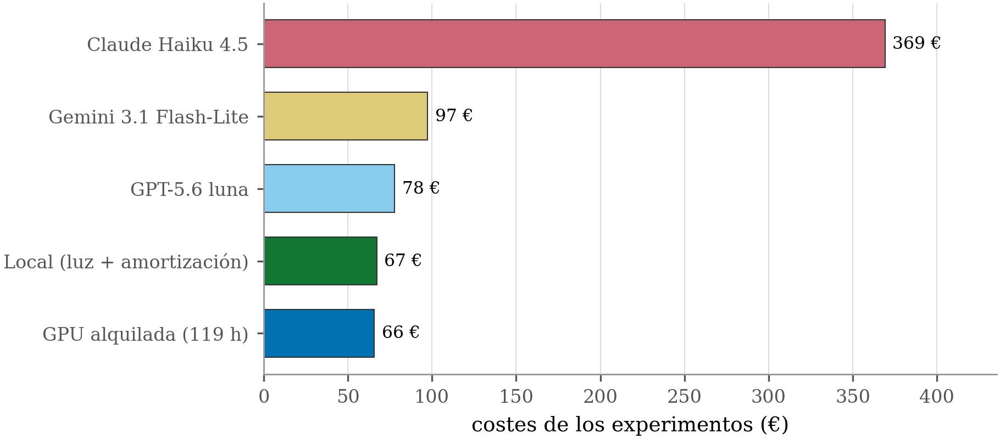

<!-- Generado por _build/generar_textos.py — no editar a mano -->

# Experimento 4 · Coste y energía

**Respalda la Tabla 6.1 de la memoria** («Coste mensual en euros de las cinco opciones,
según el volumen de consultas») y las cifras del §6.1.

> Las cifras de esta página son las **impresas en la memoria**. Para comprobar
> que salen de los datos de este repositorio:
>
> ```bash
> python3 herramientas/verificar_memoria.py
> ```

## Qué se midió

Cuánto cuesta realmente sostener el servicio en infraestructura propia, y a partir de qué
volumen sale a cuenta frente a pagar una API comercial.

## Diseño

Todas las consultas atendidas durante el período de trabajo quedaron registradas con su
recuento de tokens y su tiempo de generación. Ese libro mayor se cruza con la telemetría de
potencia de GPU para obtener el consumo energético real por consulta, y de ahí el coste por
consulta y el punto de equilibrio frente a la alternativa comercial.

## Cifras del capítulo 6

| Concepto | Valor |
|---|---|
| Consultas del estudio | 68.521 |
| Tokens de entrada | 311,4 millones |
| Tokens de salida | 23,5 millones |
| Energía de GPU medida | 20,28 kWh |
| Energía de pared (PUE 1,35) | 37,4 kWh |
| Coste eléctrico | 6,35 € |
| Horas de máquina | 119,3 h |
| Amortización imputable | 60,76 € |
| **Coste total local** | **67,11 €** |

La proporción de la factura que correspondería a «leer» documentos y no a generar texto va
del **61,4 %** al **76,8 %** según el proveedor — el texto de la
memoria lo redondea a «entre el 61 y el 77 %».

## Tabla 6.1 — Coste mensual por volumen

| Opción | 1.000 | 5.000 | 20.000 | 100.000 |
|---|---|---|---|---|
| GPT-5.6 luna | 1,2 | 5,9 | 23,5 | 117,6 |
| Gemini 3.1 Flash-Lite | 1,5 | 7,3 | 29,4 | 147,0 |
| Claude Haiku 4.5 | 5,6 | 27,9 | 111,5 | 557,3 |
| Estación RTX 5090 | 166,4 | 166,8 | 168,1 | 175,4 |
| GPU alquilada | 396,0 | 396,0 | 396,0 | 396,0 |

La fila local publica el total: los 125 €/mes de
amortización del equipo (7.500 € a 60 meses) más el gasto
mensual de electricidad y mantenimiento. En `analisis_costes.json` ambos conceptos van
separados, en `mensual_eur` y `capex_eur`.

## Contenido

| Ruta | Qué es |
|---|---|
| `analisis_costes.json` | tarifas, escenarios y punto de equilibrio: **de aquí sale la Tabla 6.1** |
| `resumen_global.json` | inventario consolidado de consultas, tokens y energía |
| `costes_servicio.csv` | coste acumulado del servicio en el tiempo |
| `breakeven.csv` | punto de equilibrio frente a la API comercial por volumen |
| `sensibilidad.csv` | sensibilidad del resultado al precio del kWh |
| `inventario_*.csv` | detalle por experimento, evaluación y ventana de telemetría |
| `INFORME_COSTES.html` | informe autocontenido |

## Reproducir

```bash
python3 herramientas/analisis_costes_nube.py    # opera sobre resumen_global.json
```

`herramientas/inventario_tokens_energia.py` regenera `resumen_global.json`, pero necesita
acceso a la base de datos donde vive el registro de consultas.

## Figuras

Las mismas que aparecen en la memoria.

### Evolución del coste acumulado a cinco años (Figura 6.2)


### Coste de los experimentos frente a las API comerciales (Figura 6.1)


