<!-- Generado por _build/generar_textos.py — no editar a mano -->

# Experimento 5 · Carga y motores de inferencia

**Pregunta:** ¿aguanta el sistema varios profesionales consultando a la vez, y qué motor
de inferencia lo sostiene mejor? ¿Dónde está el punto en que la latencia deja de ser
aceptable?

## Diseño

Barridos de concurrencia con secuencias de preguntas emparejadas: los mismos usuarios
simulados, las mismas preguntas y el mismo orden en todas las configuraciones, para que la
comparación entre motores no dependa de qué preguntas tocaron. Cada celda se repite varias
veces y se toma la mediana. Durante toda la ejecución se muestrea la telemetría de GPU.

- **609 barridos** en 3 campañas, sobre 2 máquinas
- **3.716 mediciones** por nivel de concurrencia
- **58.152 peticiones** individuales registradas
- Niveles de concurrencia: 1, 5, 10, 15, 20, 25, 50, 75, 100, 150, 200

## Resultado

Mediana del tiempo de pared en segundos, máquina `voz05`:

| Motor | 1 usu. | 5 usu. | 10 usu. | 15 usu. | 20 usu. | 25 usu. |
|---|---|---|---|---|---|---|
| llamacpp | 3,9 | 12,0 | 21,3 | 32,2 | 40,9 | 53,8 |
| ollama | 4,8 | 15,7 | 28,8 | 45,2 | 62,8 | 75,8 |
| vllm | 3,2 | 6,2 | 8,6 | 9,1 | 10,8 | 12,8 |

Los informes en `informes/` contienen las tablas completas, los intervalos de las
repeticiones y las figuras. Son HTML autocontenidos: se descargan y se abren, sin servidor.

## Contenido

| Ruta | Qué es |
|---|---|
| `barridos.csv` | 3.716 filas: una por campaña, motor, celda, repetición y nivel de concurrencia |
| `peticiones.csv` | 58.152 filas: una por petición, con TTFT y tiempos de router, recuperador y generador |
| `informes/` | informes HTML autocontenidos con las tablas y figuras |
| `configuraciones-de-motor.md` | parámetros exactos de arranque de cada motor |
| `comparativa-de-motores/` | logs y barridos de la comparativa entre los tres motores |
| `experimentos-vllm/` | pruebas A/B de caché de prefijo y barrido de saturación |

Las dos tablas CSV consolidan lo que en el repositorio de trabajo eran miles de ficheros
`sweep.json` anidados. Cada fila conserva la columna `origen` con la ruta del fichero del
que salió, de modo que cualquier medición puede rastrearse hasta su origen.

## Nota sobre lo que no está

La telemetría de GPU en crudo (unos 62 MB de muestreos por ejecución) y los volcados de
métricas de vLLM en formato Prometheus (57 MB) no se incluyen: son voluminosos y su
contenido ya está agregado en los informes. Se facilitan a quien los solicite.

## Reproducir

Reejecutar los barridos requiere el sistema completo y las máquinas de cómputo. Lo que sí
se puede recalcular es cualquier agregado sobre las tablas publicadas:

```bash
python3 -c "
import csv, statistics as st
from collections import defaultdict
p = defaultdict(list)
for f in csv.DictReader(open('experimentos/5-carga-y-motores/barridos.csv')):
    if f['motor'] and f['concurrencia'] == '10':
        p[f['motor']].append(float(f['tiempo_muro_ms']))
for m, v in sorted(p.items()):
    print(f'{m:10} mediana {st.median(v)/1000:6.1f} s  (n={len(v)})')"
```

## Figuras

Las mismas que aparecen en la memoria.

### Comparativa entre máquinas


### Ocupación de la caché KV

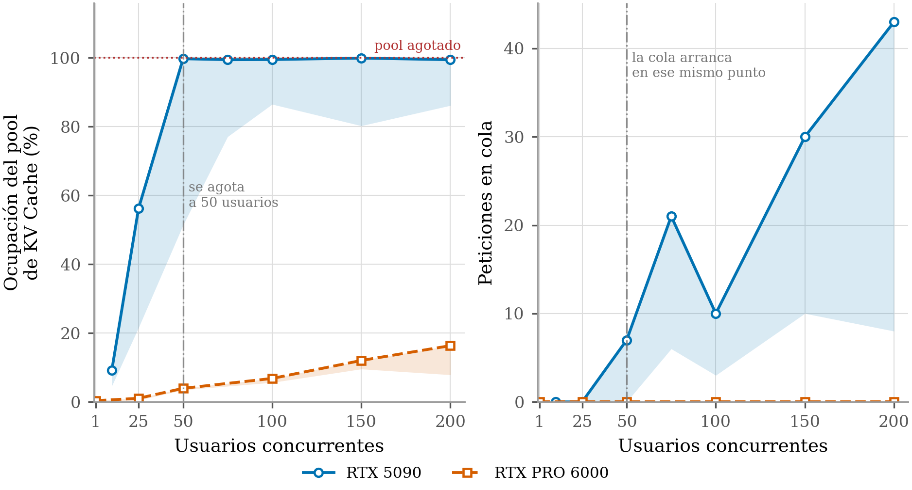

### Comportamiento del modelo de mezcla de expertos


### Comparativa entre motores de inferencia

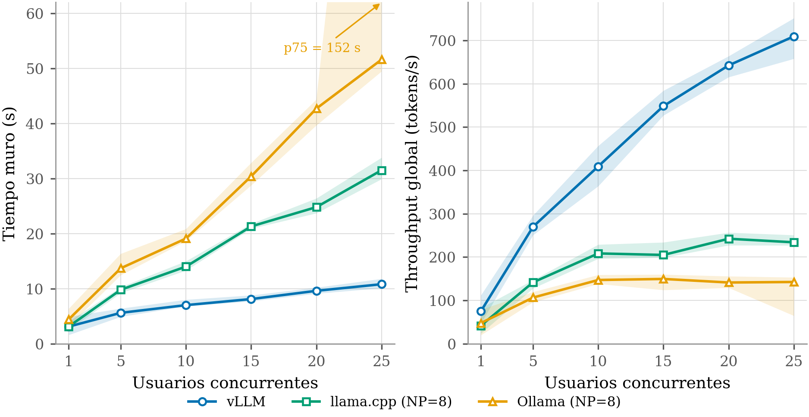

### Efecto de la caché de prefijo

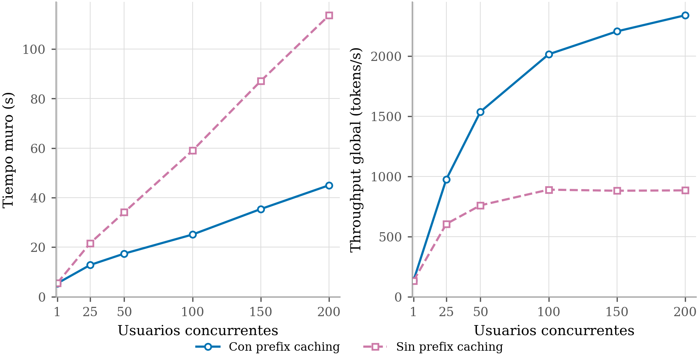

### Curva de saturación

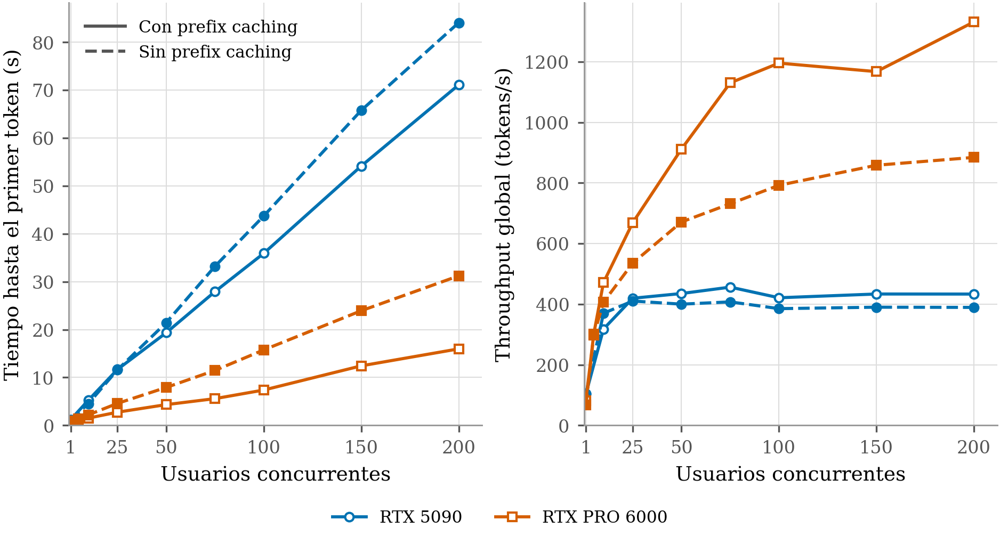

### Saturación por modelo

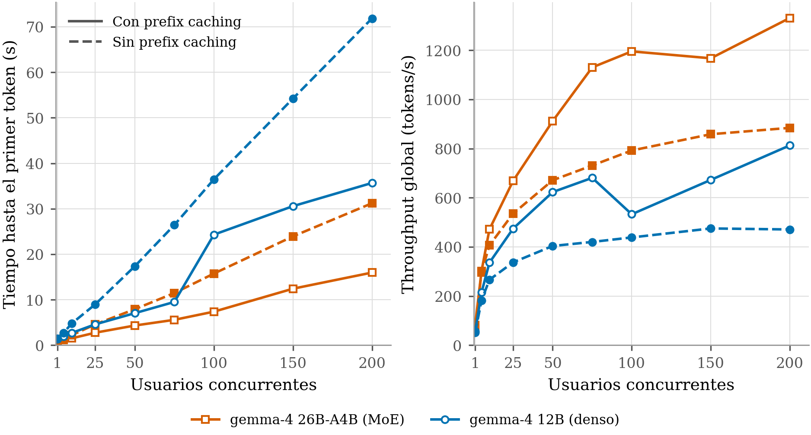

### Eficiencia energética por token

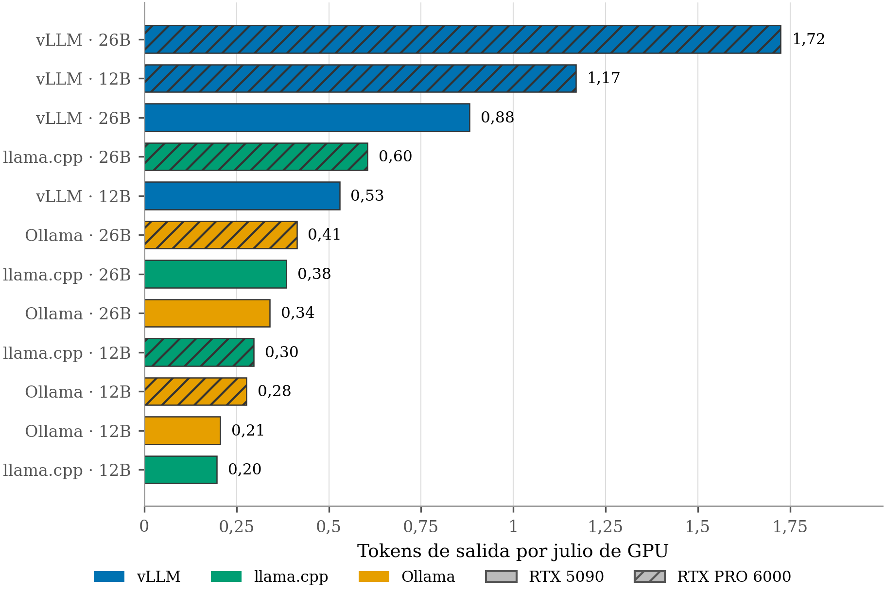

### Telemetría del modelo de mezcla de expertos

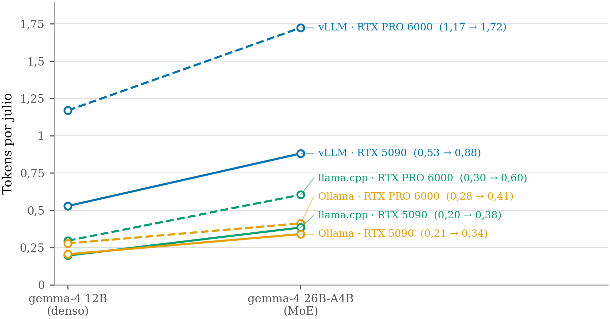

### Potencia de GPU

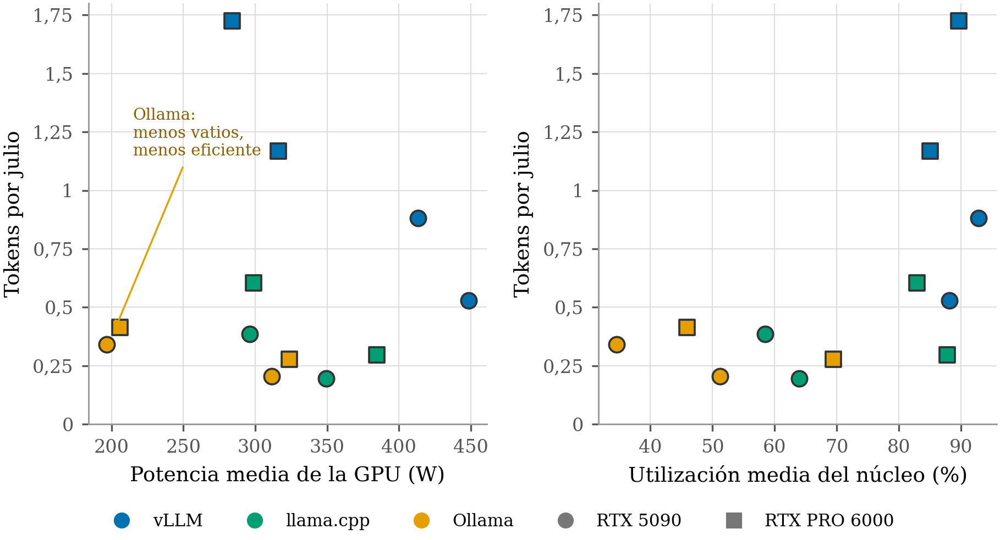

### Potencia a lo largo del tiempo

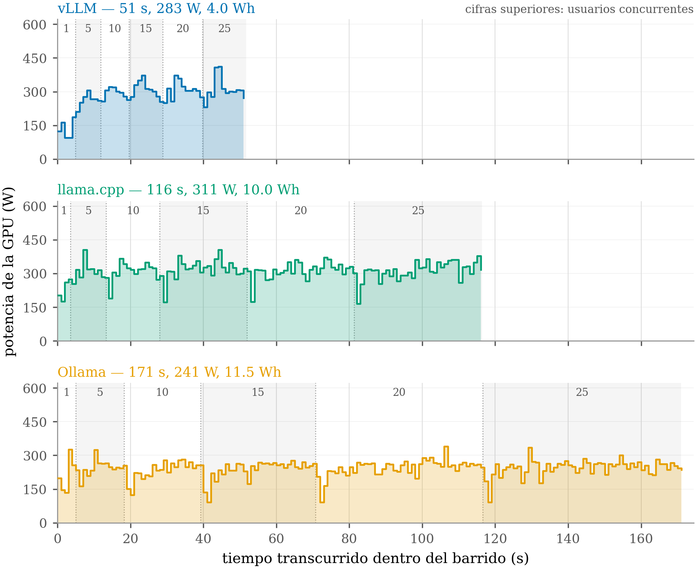

### Potencia en el tiempo, RTX 5090

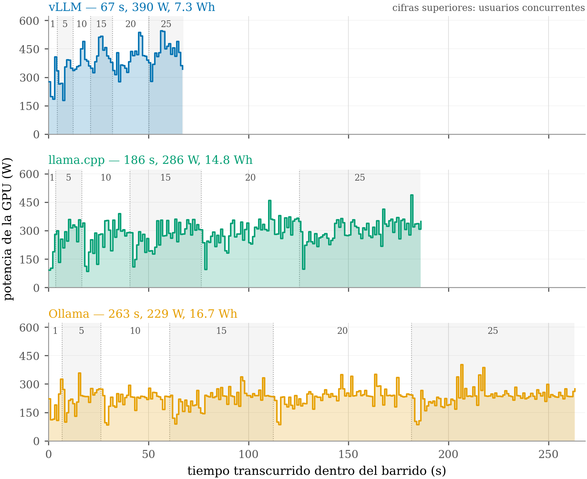

### Potencia en el tiempo, ambas máquinas

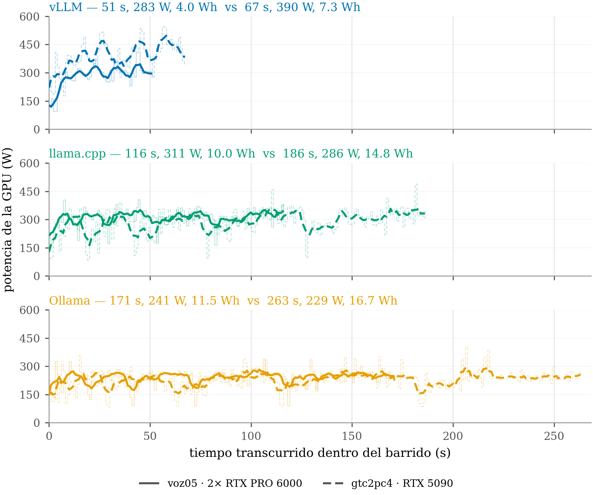

### Utilización de GPU

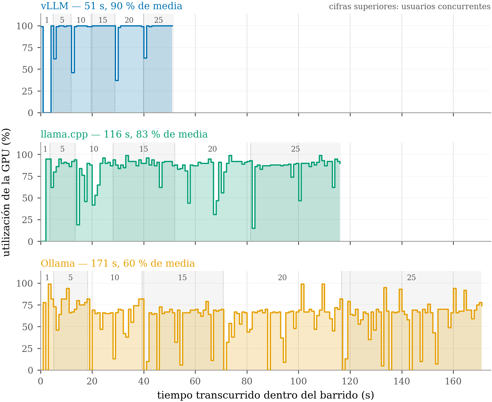

### Utilización de GPU, RTX 5090


### Utilización comparada

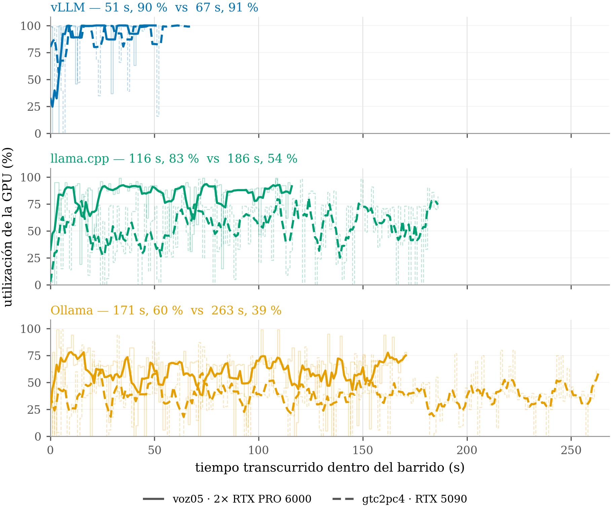

