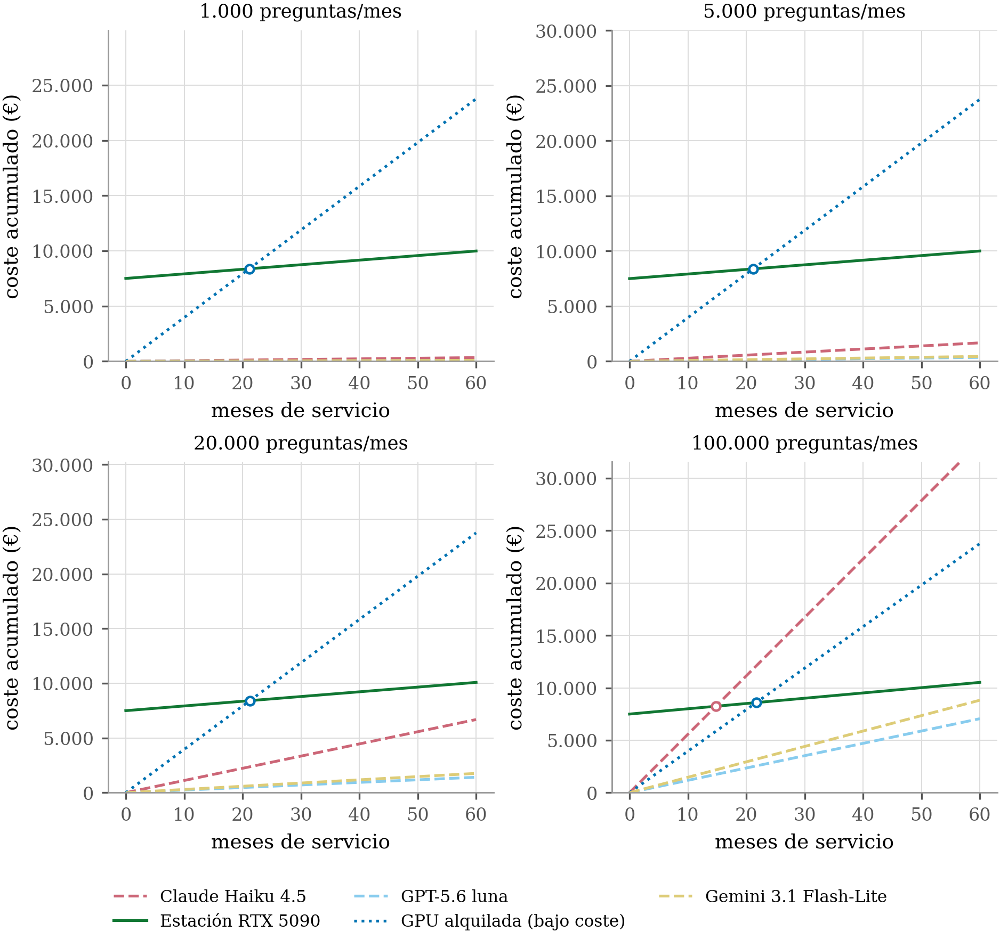
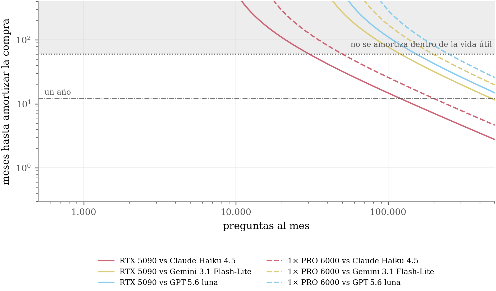
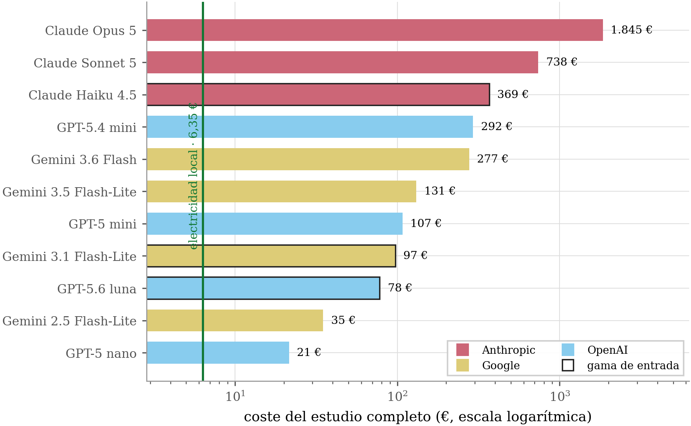
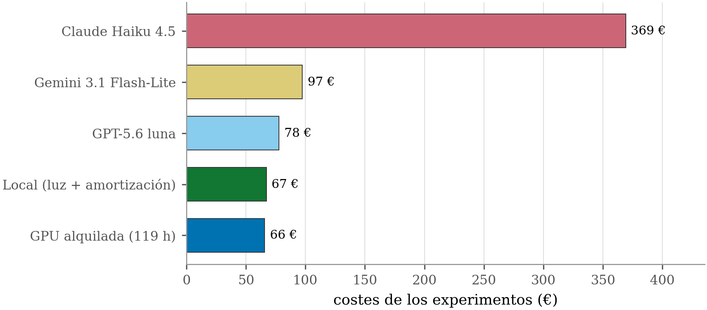
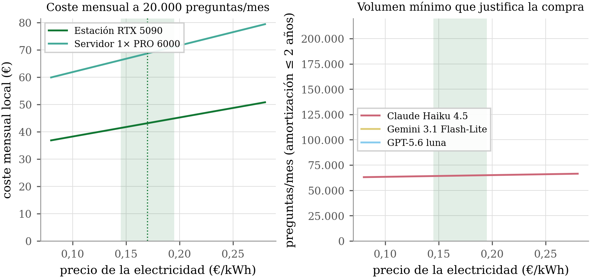
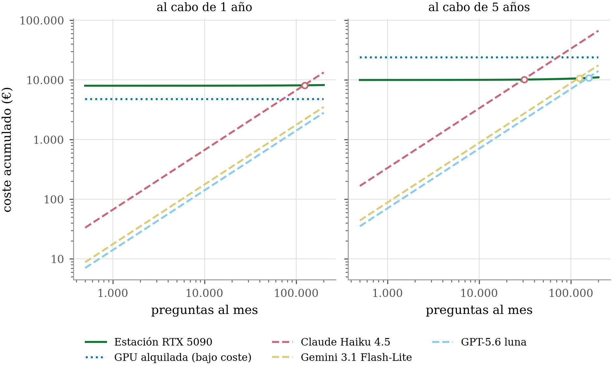

<!-- Generado por _build/generar_textos.py — no editar a mano -->

# Experimento 6 · Coste y energía

**Pregunta:** ¿cuánto cuesta realmente sostener este servicio en infraestructura propia, y
a partir de qué volumen sale a cuenta frente a pagar una API comercial?

## Diseño

Todas las consultas atendidas por el sistema durante el período de trabajo quedaron
registradas con su recuento de tokens y su tiempo de generación. Ese libro mayor se cruza
con la telemetría de potencia de GPU para obtener el consumo energético real por consulta,
y de ahí el coste por consulta y el punto de equilibrio frente a la alternativa comercial.

## Volumen

- **68.521 consultas** registradas entre
  2026-05-15 y 2026-08-25
- **311.356.613 tokens de entrada** y
  23.464.685 de salida
- **20,28 kWh** de energía de GPU medida sobre
  87,4 h de telemetría

| Modelo | Consultas | Tokens de entrada | Tokens de salida | Tiempo de generación |
|---|---|---|---|---|
| `gemma4:26b` | 42.219 | 187.681.079 | 13.501.177 | 209,4 h |
| `gemma4:12b` | 23.187 | 104.863.633 | 8.304.544 | 209,4 h |
| `gemma4-awq` | 2.970 | 18.810.403 | 1.658.521 | 18,5 h |
| `?` | 143 | 0 | 0 | 0,0 h |

## Máquinas

| Máquina | GPU | TDP | Energía medida | Telemetría |
|---|---|---|---|---|
| `voz05` | 2x RTX PRO 6000 Blackwell | 600 W | 8,96 kWh | 21,9 h |
| `gtc2pc4` | 1x RTX 5090 | 575 W | 11,32 kWh | 65,6 h |
| `gtc2pc9` | 1x RTX 4090 (baseline) | 450 W | 0,00 kWh | 0,0 h |

## Cobertura

79,6 % de las consultas (50.197
de 68.521) se ejecutaron con telemetría activa. El consumo del resto se
imputa por extrapolación a partir de las que sí la tienen, lo que es una fuente de error
que conviene tener presente al leer el coste por consulta.

## Contenido

| Ruta | Qué es |
|---|---|
| `resumen_global.json` | inventario consolidado de consultas, tokens y energía |
| `analisis_costes.json` | tarifas, escenarios y cálculo del punto de equilibrio |
| `costes_servicio.csv` | coste acumulado del servicio en el tiempo |
| `breakeven.csv` | punto de equilibrio frente a la API comercial por volumen |
| `sensibilidad.csv` | sensibilidad del resultado al precio del kWh |
| `inventario_*.csv` | detalle por experimento, evaluación y ventana de telemetría |
| `INFORME_COSTES.html` | informe autocontenido con las figuras |

## Reproducir

```bash
python3 herramientas/inventario_tokens_energia.py    # requiere el libro mayor en base de datos
python3 herramientas/analisis_costes_nube.py         # opera sobre resumen_global.json
```

El primero necesita acceso a la base de datos donde vive el registro de consultas. El
segundo funciona sobre el JSON publicado.

## Figuras

Las mismas que aparecen en la memoria.

### Coste acumulado del servicio



### Punto de equilibrio por volumen



### Comparación entre proveedores



### Comparación de coste frente a API comercial



### Sensibilidad al precio del kWh



### Volumen acumulado de consultas



